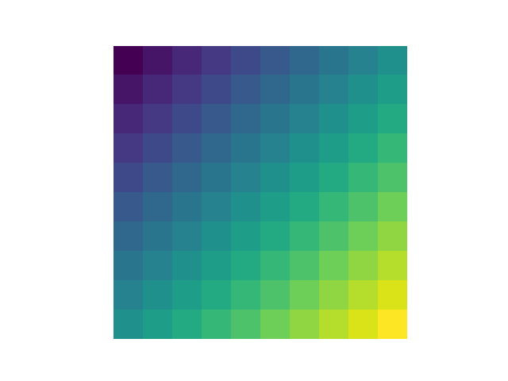

# New-Numpy-Matplotlib-examples
Hi, there!, Your visit in this repository is your first step to dive
into two Python libraries of  a great importance - NumPy and Matplotlib -
_very_ deeply.

<p align="center">
  
</p>

---

## About the project

New Numpy-Matplotlib Examples is - as the name suggests - a set
of exemplary programs exploring great capabilities of two fundamental
Python libraries: NumPy and Matplotlib.

Generally, in terms of third-party libraries, examples in these project
use ONLY these two packages (however, a few more packages need to be installed,
e.g. JupyterLab as the environment to present the code working, and ipympl
for Matplotlib to work in JupyterLab).

## Project modules

The project consists of the following parts:

1. **Basics** - notebooks with explanation of basics of NumPy and Matplotlib and
fundamental features presentation; materials from this part may well be used as
an introduction to these packages
2. **Neural network** - a framework to build and train neural networks, written in
pure NumPy, along with some experiments and visualizations
3. **Image processing** - Computer Vision examples, including channels manipulation, 
images transformations and edge detection

## How to run

- code in `.py` files

In order to use utilities implemented in `.py` modules in this repo,
you **only need NumPy and Matplotlib** have installed (and Python 3,
of course 😀):

```commandline
pip install numpy matplotlib
```

Then, you can just import desired utilities, for example:


```bash
PYTHONPATH=$(pwd)/part-2-neural-network python3
```

```python
>>> import numpy as np
>>> from nn.structures import LayersSequence
>>> from nn.linear import LinearLayer
>>> from nn.activations import ReLUActivation
>>>
>>> mlp = LayersSequence([
...     LinearLayer(n_inputs=2, n_outputs=3),
...     ReLUActivation(),
...     LinearLayer(n_inputs=3, n_outputs=2)
... ])
>>>
>>> x = np.random.uniform(-1, 1, (64, 2))
>>> mlp.forward(x)
```

- notebooks

To run examples in notebooks, you'll need to install just two additional
libraries:

```commandline
pip install jupyterlab ipympl
```

Then, you can run Jupyter Lab and navigate to the notebook you'd like
to run:

```commandline
jupyter lab
```

- use `requirements.txt`

You also may just use `requirements.txt`. This will install all four libraries
mentioned above plus `black`, which you can use to format your code.

```commandline
pip install -r requirements.txt
```

## Utilized datasets

**Iris**

Fisher, R. (1936). Iris [Dataset]. UCI Machine Learning Repository. https://doi.org/10.24432/C56C76.

Link to the page: https://archive.ics.uci.edu/dataset/53/iris

License: [Creative Commons Attribution 4.0 International](https://creativecommons.org/licenses/by/4.0/legalcode)

**Images**

 - lviv.jpg - _Lviv, Wały Hetmańskie avenue, ca 1900_,
source: _Album pamiątkowy miasta Lwowa_, Józef Pitułko, 1904,
https://commons.wikimedia.org/wiki/File:Lwow_Waly_Hetmanskie_c1900.jpg?uselang=pl#file,
license: public domain
 - prague.jpg - _Prague Castle_, source: https://www.publicdomainpictures.net/pl/view-image.php?image=218&picture=zamek-praski,
license: [CC0 Public Domain](http://creativecommons.org/publicdomain/zero/1.0/)
